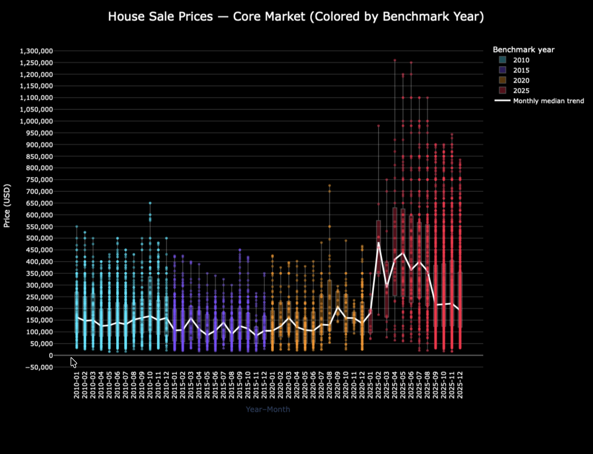

# UrbanGrowthSDG11 – A City-Agnostic Pipeline for Harmonized Housing Listings Data


[](https://doi.org/10.5281/zenodo.18226144)
[](https://doi.org/10.5281/zenodo.18226606)



*Figure 1. Distribution of residential house sale prices by benchmark year, shown for quality control and outlier validation purposes.*


## 1. Project Overview

This project documents the construction of a historical, spatially explicit real‑estate listings dataset for Tegucigalpa, Honduras, aligned with **Sustainable Development Goal 11 (Sustainable Cities and Communities)**. The dataset focuses on residential properties (houses and apartments) and reconstructs housing market signals for selected benchmark years.

The core challenge addressed is the absence of a centralized, long‑term registry of residential real‑estate listings. To overcome this, the project applies a **data archaeology** approach, combining manual extraction, semi‑automated parsing, and rigorous data validation.

---

## 2. Research Motivation

Urban housing research and planning in low‑ and middle‑income countries are often constrained by:

* Fragmented historical data sources
* Lack of spatially explicit housing market information
* Inconsistent terminology and formats across time


---

## 3. Temporal Scope

The dataset is structured around four benchmark years:

 each year is a folder under each agency

For each year, listings are sampled at monthly or near‑monthly intervals to capture market conditions while maintaining feasibility and consistency.

---

## 4. Data Sources

Listings were collected from heterogeneous sources, including:

* Printed and digitized newspapers (PDFs, scans)
* Archived web pages (via Web Archive)
* Real‑estate agency websites
* Online property portals

Each source is preserved for traceability using:

* Original URLs or archive links
* Source filenames
* Ingestion identifiers

---

## 5. Canonical Data Format

All listings are converted into a **canonical, one‑line, machine‑parsable format** using the following conventions:

* Neighborhood name precedes the listing, followed by a colon (`:`)
* All other attributes are separated by semicolons (`;`)
* Text is normalized to English for analytical fields

**Example:**

```
LOMAS DEL NUNCAJAMAS: Apartment; SALE; 3 beds; 2 baths; 120 m2; USD 185000;
```

This format ensures long‑term stability and reproducibility across years and sources.

---

## 6. Core Variables

The standardized dataset includes (where available):

* `transaction_final` (SALE / RENT)
* `property_type_new` (Apartment / House)
* `price_usd`
* `area_m2` (constructed area)
* `lot_size_m2` (terrain area, when applicable)
* `beds`
* `baths`
* `neighborhood_label`
* `neighborhood_uid`
* `GISID`
* `year_month`

Supplementary metadata fields preserve provenance and processing context.

---

## 7. Data Standardization

Standardization steps include:

* Currency normalization to USD
* Area unit conversion (e.g., varas² → m²)
* Harmonization of transaction terms (VENTA / SALE, ALQUILER / RENT)
* Property type normalization and exclusion of non‑residential types

All transformations are rule‑based and documented to ensure transparency.

---

## 8. Data Validation and Quality Control (QC)

Data quality control is treated as an explicit methodological phase.

### 8.1 Validation Stages

Listings are evaluated through multiple filters:

1. Missing or invalid prices
2. Excluded property types
3. Missing or ambiguous neighborhood/location
4. Missing spatial identifiers (GIS linkage)

Listings are **flagged, not deleted**, preserving transparency and auditability.

### 8.2 Outlier Detection

After standardization, numerical fields are evaluated using:

* Descriptive statistics
* Box plots
* Unsupervised anomaly detection (e.g., Isolation Forest, LOF)

Outliers are retained with flags rather than removed.

---

## 9. Spatial Integration

Neighborhoods are represented as polygons and linked to listings via:

* Cleaned neighborhood labels
* Unique neighborhood identifiers

Spatial outputs are stored in **GeoPackage (GPKG)** format to support:

* Multi‑year joins
* Efficient querying
* Reproducible GIS workflows

---

## 10. Outputs

The project produces:

* Cleaned CSV tables
* GeoPackage layers (by year and transaction type)
* Summary statistics tables (min, max, mean, median, stdev, counts)
* Maps and figures for publication

All outputs are versioned and reproducible.

---

## 11. Reproducibility and Ethics

* No personally identifiable information is included
* Original sources are cited and preserved
* Scripts are version‑controlled
* All assumptions and thresholds are documented

---

## 12. Intended Use

This dataset supports:

* Urban housing market analysis
* SDG‑11 indicators and proxies
* Comparative temporal analysis
* Open data and methodological research

---

## 13. Project Status

The project is currently in the final stages of:

* Data validation
* Spatial aggregation
* Figure and table preparation for publication

Future work includes expanded automation and cross‑city replication.

## 14. How to use this code

## Documentation Index

## How to Navigate This Repository

- **Pipeline overview** → `real_estate_parser/Doc/process_index.md`
- **Synthetic data & execution** → `real_estate_parser/Doc/data_index.md`
- **Step-by-step scripts** → `real_estate_parser/Doc/`


