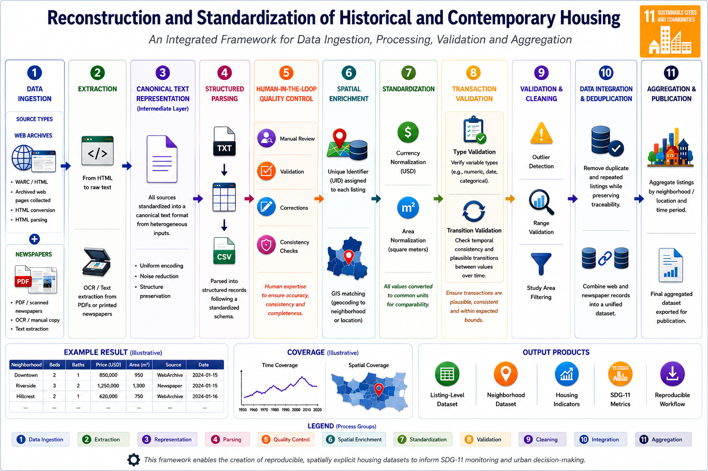

# UrbanGrowthSDG11 – A City-Agnostic Framework for Harmonized Housing Listings Data

## Dataset

[](https://doi.org/10.5281/zenodo.18778210)

## Software

[](https://doi.org/10.5281/zenodo.18226606)

---

 

<p align="center">
  
</p>

<p align="center">
<i>Figure 1. SDG11_ORCHESTRATOR_V3 framework architecture showing multi-source text acquisition, canonical text harmonization, orchestrated processing modules, continuous human-in-the-loop review, and harmonized neighborhood-level outputs.</i>
</p>
A configuration-driven workflow framework for constructing harmonized, reproducible, neighborhood-level housing datasets from heterogeneous historical sources.

The framework integrates multiple acquisition pathways, canonical text processing, rule-based extraction, quality control, spatial harmonization, and aggregation into a unified and auditable workflow.

The architecture was designed for data-scarce environments where housing information is fragmented across newspapers, archived webpages, agency websites, and property portals.

---

## Framework Overview

The SDG11_ORCHESTRATOR_V3 coordinates all processing modules through external configuration files, enabling:

- Modular execution
- Version-controlled workflows
- Resume capability
- Intermediate QA generation
- Human-in-the-loop review
- Transparent audit trails
- Reproducible outputs

The orchestrator manages the complete processing pipeline while preserving intermediate outputs for validation and review.

---

## Architecture

### Data Acquisition

Two independent acquisition pipelines converge into a common canonical text representation.

#### Newspaper Pipeline

```text
PDF Newspapers
      ↓
Copy & Paste
      ↓
TXT
```

#### Web / Archive Pipeline

```text
Internet Archive Snapshot (WebArchive)
      ↓
textutil
      ↓
HTML
      ↓
BeautifulSoup
      ↓
TXT
```

---

### Canonical Text Layer

All sources are converted into a standardized UTF-8 text representation.

Example:

```text
LOMAS DEL NUNCAJAMAS: Apartment; SALE; 3 beds; 2 baths; 120 m2; USD 185000;
```

The canonical representation provides a stable and source-independent input format for all downstream modules.

---

## Orchestrated Processing Pipeline

The framework executes the following modules in sequence:

```text
1. Parsing & Extraction
2. Merge Datasets
3. Human-in-the-Loop QC
4. Deduplication
5. Word Filter
6. Standardization
7. UID Assignment
8. GIS Matching
9. Price Conversion
10. Area Conversion
11. Validation
12. Neighborhood Aggregation
```

---

## Human-in-the-Loop Design

Human review is not limited to a single stage.

Every module generates:

- Intermediate outputs
- QA artifacts
- Audit information
- Validation reports

Review can occur after any processing stage before continuing to the next step.

This design prioritizes transparency, traceability, and reproducibility over black-box automation.

---

## Core Principles

### Multiple Acquisition Methods

Supports historical newspapers, archived webpages, agency websites, and property portals.

### Canonical Text Representation

All inputs converge to a common UTF-8 representation independent of source format.

### Human-in-the-Loop Validation

Manual review can be performed throughout the workflow.

### Configuration-Driven Execution

Pipeline behavior is controlled through external JSON configuration files rather than hard-coded workflows.

### Reproducible Processing

All transformations are deterministic, documented, and version controlled.

### Open Science

Outputs are designed for publication, replication, and long-term preservation.

---

## Final Outputs

The framework produces:

- Cleaned CSV tables
- GeoPackage (GPKG) layers
- Neighborhood-level indicators
- Summary statistics
- Publication-ready maps
- Reproducible research datasets

Outputs are suitable for:

- SDG 11 monitoring
- Urban housing research
- Spatial analysis
- Longitudinal housing market studies
- Cross-city comparative applications

---

## Intended Use

UrbanGrowthSDG11 was developed to support the reconstruction of historical housing markets in data-scarce environments and to provide a reusable framework for housing-data harmonization across cities and countries.

The framework emphasizes transparency, auditability, reproducibility, and methodological transferability.


